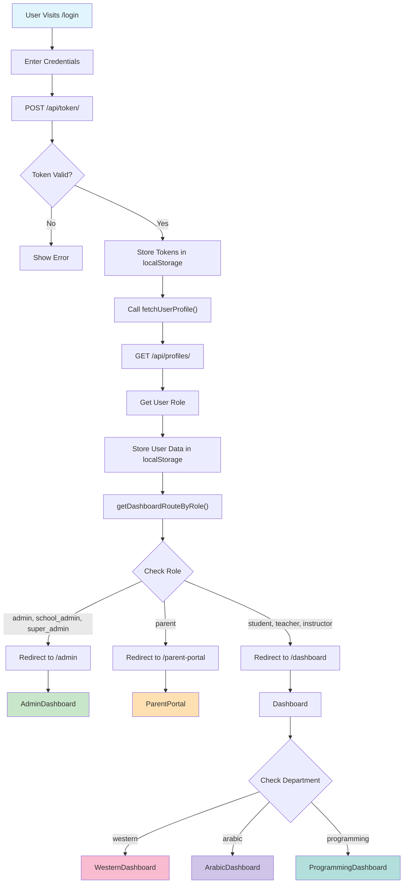

---

## System Architecture Overview

```
┌─────────────────────────────────────────────────────────────┐
│                    Landing Page (/)                          │
│         (Shows for non-authenticated users)                  │
└────────────────────────┬────────────────────────────────────┘
                         │
              [User clicks "Login"]
                         │
                         ▼
         ┌─────────────────────────────┐
         │   Login Page (/login)       │
         │  - Username/Password        │
         │  - Error Handling           │
         └────────────┬────────────────┘
                      │
         [Submit credentials]
                      │
                      ▼
    ┌──────────────────────────────────┐
    │   Backend: POST /api/token/      │
    │   Returns: access_token,         │
    │            refresh_token         │
    └────────────┬─────────────────────┘
                 │
          [If Valid]
                 │
                 ▼
    ┌──────────────────────────────────┐
    │ authUtils.handleLoginSuccess()   │
    │ 1. Store tokens                  │
    │ 2. Fetch user profile            │
    │ 3. Store user data (with role)   │
    │ 4. Get dashboard route           │
    └────────────┬─────────────────────┘
                 │
                 ▼
    ┌──────────────────────────────────┐
    │ GET /api/profiles/ (/profiles/)  │
    │ Response: {                      │
    │   role: "student" | "admin" ...  │
    │   department: "western" ...      │
    │   ... other fields ...           │
    │ }                                │
    └────────────┬─────────────────────┘
                 │
               [Role Check]
                 │
    ┌────────┬───────────┬──────────┐
    │        │           │          │
    ▼        ▼           ▼          ▼
  Admin₃   Parent     Student    Teacher
    │        │           │          │
    ▼        ▼           ▼          ▼
 /admin  /parent-    /dashboard /dashboard
         portal


┌─────────────────────────────────────────────────────┐
│          MAIN APPLICATION ROUTES (Protected)        │
├─────────────────────────────────────────────────────┤
│ /dashboard                                          │
│ ├─ WesternDashboard (department = "western")       │
│ ├─ ArabicDashboard (department = "arabic")         │
│ └─ ProgrammingDashboard (department = "programming")
│                                                     │
│ /admin (AdminDashboard)                            │
│ ├─ Overview Tab (system statistics)               │
│ ├─ Users Tab (user management)                    │
│ └─ Courses Tab (course inventory)                 │
│                                                     │
│ /parent-portal (ParentPortal)                      │
│ ├─ Children List                                  │
│ ├─ Child Progress Metrics                         │
│ ├─ Enrollments                                    │
│ ├─ Quiz Scores                                    │
│ └─ Achievements                                   │
│                                                     │
│ Other Protected Routes:                            │
│ ├─ /courses, /enrollments, /assignments          │
│ ├─ /quizzes, /analytics, /achievements           │
│ ├─ /projects, /milestones, /ai, /practice        │
│ └─ /manage-users                                 │
└─────────────────────────────────────────────────────┘


┌──────────────────────────────────────────────────────────┐
│              SIDEBAR MENU FILTERING                       │
├──────────────────────────────────────────────────────────┤
│                                                           │
│ Read from localStorage: user.role                         │
│                                                           │
│ ┌─────────────────────────────────────────────────┐     │
│ │ ALL LINKS:                                       │     │
│ │ • Dashboard, Courses, My Classes, Assignments   │     │
│ │ • Quizzes, Achievements, Projects, Milestones  │     │
│ │ • AI Help, Practice                             │     │
│ │                                                  │     │
│ │ ROLE-RESTRICTED:                                │     │
│ │ • Analytics → [instructor, teacher, admin]      │     │
│ │ • Manage Users → [admin, school_admin]          │     │
│ │ • Admin Dashboard → [admin, school_admin]       │     │
│ │ • Parent Portal → [parent]                      │     │
│ └─────────────────────────────────────────────────┘     │
│                                                           │
│ Component: Sidebar.tsx                                   │
│ Uses: useMemo() for role-based filtering                │
└──────────────────────────────────────────────────────────┘


┌──────────────────────────────────────────────────────┐
│             LOGOUT FLOW                              │
├──────────────────────────────────────────────────────┤
│                                                      │
│ User clicks "🚪 Logout"                             │
│           │                                         │
│           ▼                                         │
│ clearUserData() → Removes:                          │
│ • access_token                                      │
│ • refresh_token                                     │
│ • user (stored profile)                             │
│           │                                         │
│           ▼                                         │
│ window.location.href = "/login"                     │
│           │                                         │
│           ▼                                         │
│ Navbar shows: [Login] [Sign Up]                     │
│ Sidebar hidden                                      │
│ Landing page accessible again                       │
└──────────────────────────────────────────────────────┘
```

---

## Data Flow: localStorage State

### After Login (Student Example)

```json
{
  "access_token": "eyJ0eXAiOiJKV1QiLCJhbGc...",
  "refresh_token": "eyJ0eXAiOiJKV1QiLCJhbGc...",
  "dark_mode": "false",
  "user": {
    "id": 1,
    "username": "student001",
    "email": "student@example.com",
    "role": "student",
    "department": "western"
  }
}
```

### After Login (Admin Example)

```json
{
  "access_token": "eyJ0eXAiOiJKV1QiLCJhbGc...",
  "refresh_token": "eyJ0eXAiOiJKV1QiLCJhbGc...",
  "dark_mode": "false",
  "user": {
    "id": 2,
    "username": "admin001",
    "email": "admin@example.com",
    "role": "admin",
    "department": "western"
  }
}
```

### After Logout

```json
{
  "dark_mode": "false"
}
```

(All auth data cleared)

---

## Component Dependency Graph

```
App.tsx
├── HomeRouter (NEW)
│   └── Conditional render based on token & role
├── Navbar.tsx (MODIFIED)
│   └── clearUserData() on logout
├── Sidebar.tsx (MODIFIED)
│   └── Role-based menu filtering
├── Public Routes
│   ├── /login → Login.tsx (MODIFIED)
│   │   └── handleLoginSuccess() new flow
│   ├── /signup → Signup.tsx
│   ├── /about, /programs, /locations, /contact
│   └── / → HomeRouter (was Landing)
└── Protected Routes
    ├── /dashboard → Dashboard.tsx
    │   ├── WesternDashboard.tsx
    │   ├── ArabicDashboard.tsx
    │   └── ProgrammingDashboard.tsx
    ├── /admin → AdminDashboard.tsx (NEW)
    ├── /parent-portal → ParentPortal.tsx (NEW)
    ├── /courses, /enrollments, /assignments
    ├── /quizzes, /Analytics, /achievements
    └── ... other protected routes
```

---

## API Integration Points

```
Authentication:
├── POST /api/token/              [Login endpoint]
│   ├── Input: {username, password}
│   └── Output: {access, refresh}
│
├── POST /api/token/refresh/      [Token refresh - auto handled]
│   ├── Input: {refresh}
│   └── Output: {access}
│
└── GET /api/profiles/            [Get current user profile]
    ├── Headers: Authorization: Bearer {token}
    └── Output: [{id, user, role, department, ...}]


Core Data Fetching:
├── GET /api/courses/             [List courses]
├── GET /api/enrollments/         [List enrollments]
├── GET /api/assignments/         [List assignments]
├── GET /api/quiz-submissions/    [List quiz scores]
├── GET /api/assignment-submissions/ [List submissions]
├── GET /api/achievements/        [List achievements]
└── GET /api/profiles/?role=...   [Filter by role]


Permissions Enforced:
├── Backend ProfileViewSet.get_queryset()
│   ├── Admin/Teacher → department filter
│   ├── Parent/Student → user filter
│   └── Superuser → no filter
└── All endpoints return 403 if unauthorized
```

---

## Key File Changes Summary

### authUtils.ts (NEW)

**Purpose**: Centralize authentication logic
**Functions**:

- `fetchUserProfile()` → GET /api/profiles/
- `getDashboardRouteByRole(role: string)` → returns /admin, /parent-portal, or /dashboard
- `storeUserData(userData)` → JSON.stringify to localStorage
- `getUserData()` → JSON.parse from localStorage
- `clearUserData()` → remove all auth data
- `handleLoginSuccess(access, refresh)` → complete login flow

### Login.tsx (MODIFIED)

**Change**: Use `handleLoginSuccess()` instead of manual token storage
**Before**:

```tsx
window.location.href = "/";
```

**After**:

```tsx
const route = await handleLoginSuccess(resp.data.access, resp.data.refresh);
window.location.href = route;
```

### Navbar.tsx (MODIFIED)

**Change**: Use `clearUserData()` on logout
**Before**:

```tsx
localStorage.removeItem("access_token");
localStorage.removeItem("refresh_token");
```

**After**:

```tsx
import { clearUserData } from "../utils/authUtils";
clearUserData();
```

### Sidebar.tsx (MODIFIED)

**Change**: Filter menu items by user role
**Before**: Showed all links to all users
**After**:

- Read role from `localStorage.user.role`
- Filter links based on `roles` property
- Admin links only show for admin roles
- Parent portal only for parent role

### App.tsx (MODIFIED)

**Change**: Add HomeRouter and redirect authenticated users
**Added**:

- HomeRouter component
- Imports for routing utilities
- "/" route uses HomeRouter instead of Landing

---

## Testing Checklist

- [ ] User can login with valid credentials
- [ ] User is redirected to correct dashboard based on role
- [ ] Student sees WesternDashboard (or appropriate dept dashboard)
- [ ] Admin sees AdminDashboard
- [ ] Parent sees ParentPortal
- [ ] Sidebar shows correct menu items for each role
- [ ] User can logout and returns to login page
- [ ] Accessing "/" while logged in redirects to dashboard
- [ ] Accessing "/" while not logged in shows landing page
- [ ] Accessing protected routes without token redirects to login
- [ ] Token refresh works when token expires
- [ ] User data persists across page reloads
- [ ] Dark mode preference persists
- [ ] Admin can filter users by role

---

**System Architecture Version**: 2.0
**Implementation Date**: March 2, 2026
**Status**: ✅ Complete and Ready for Testing
